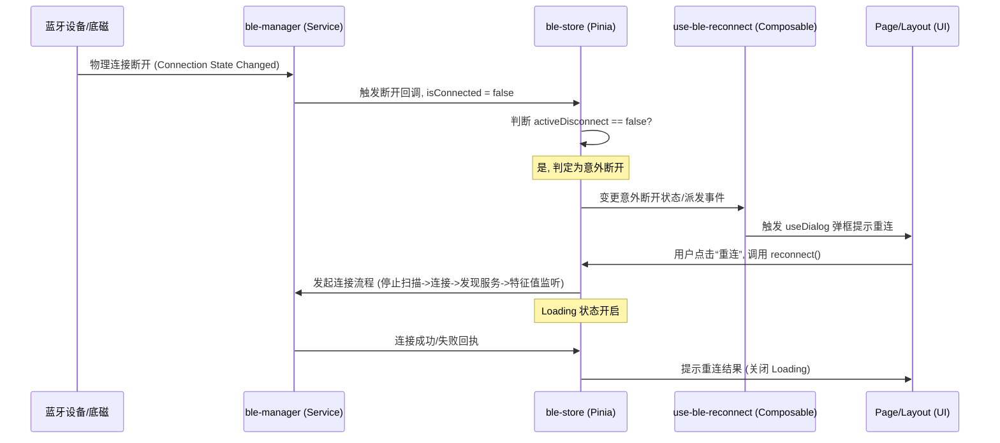

# Technical Design - ble-disconnect-reconnect-prompt

本设计用于在蓝牙意外断开连接时，提供全局的重连询问和流程控制。

## 1. 架构与状态流设计

蓝牙断开可能由于物理距离、异常断电等造成。我们需要在全局层面管理“主动断开”与“异常断开”的状态判定。

### 蓝牙状态判定设计 (Data Flow)

- `bleStore` 中维护 `isConnecting`, `isConnected`, `activeDisconnect`（标记用户是否主动断开）。
- 当用户在页面中点击“断开连接”按钮时，将 `activeDisconnect` 设为 `true`，然后调用蓝牙断开 API。
- 当蓝牙监听到连接断开事件（通过 `uni.onBLEConnectionStateChange`）：
  - 如果 `activeDisconnect === true`：正常断开，不作提示。
  - 如果 `activeDisconnect === false`：判定为异常断开，触发重连提示。

### 模块通信时序

---

## 2. 核心模块与文件修改设计

### 服务层修改 `service/ble-manager.ts` 或 `stores/ble-store.ts`
- 增加 `activeDisconnect` 标记。
- 在 `bleStore` 中新增 `triggerUnexpectedDisconnect()` 逻辑，并向外暴露断开提醒状态。
- 新增 `reconnectDevice()` 动作，整合“停止扫描 -> 建立物理连接 -> 发现服务 -> MTU协商 -> 特征值监听 -> 启动遥测轮询”的链路。

### Composable 封装 `composables/use-ble-reconnect.ts` (职责分离)
- 创建 `useBleReconnect` Composable。
- 负责监听意外断开标志，并整合 `useDialog`、`useToast` 触发重连确认框及 Loading 效果。
- 避免直接将重连逻辑与弹窗手写在具体页面，保持高内聚。

### UI 视图层挂载
- 确保应用的主要视图容器（如 `pages/Home/home.vue` 或 `<layout-provider>`）内挂载了 `<wd-dialog />` 和 `<wd-toast />`。

---

## 3. 兼容性与边界防御

- **小程序动态组件防御**：不使用动态 `:is`。重连对话框采用普通 Vue 模版渲染。
- **异步 Loading 锁定防御**：在重连的 Action 中必须使用 `try-catch-finally`，无论连接成功还是失败，均要在 `finally` 块中关闭 `loading` 指示。
- **扫描重叠防御**：在重连前主动调用停止扫描方法，防止触发 `10003` 错误。
