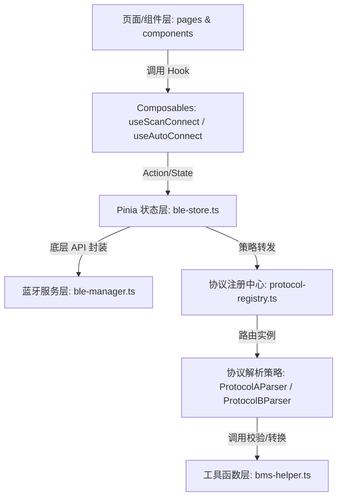

# 1. 系统整体架构与职责划分

本项目基于 Vue 3 + Pinia + TypeScript 开发，在多端（Android / iOS / 鸿蒙 / 微信小程序）兼容的前提下，针对蓝牙通信、系统权限及安全机制，设计了严密的分层架构。

---

## 一、 数据与控制解耦流向

项目的核心在于实现“界面（Pages）- 逻辑（Composables）- 数据（Store/Service）- 协议（Strategy）”的深度分离：

---

## 二、 各分层文件职责细化

必须严格遵循物理目录职责分工，防范职责混淆：

### 1. 配置层 (Config Layer)
*   **代表文件**: [config/index.ts](../config/index.ts)
*   **职责**: 仅存放全局静态运行参数（如默认 MTU 协商大小、指令写包延时、扫码匹配模式、6位日志密码、多套蓝牙服务 UUID 等）。
*   **红线**: 严禁在此编写带有运行期副作用（Side Effects）或依赖 Pinia 状态的代码。

### 2. 物理服务层 (Service Layer)
*   **代表文件**: 
    *   [service/ble-manager.ts](../service/ble-manager.ts): 负责低功耗蓝牙底层的扫描开启、物理连接建立、服务特征发现、MTU 设置、物理切片指令下发及蓝牙事件的监听注册。
    *   [service/permission.ts](../service/permission.ts): 原生系统权限及硬件开关检测，支持在 APP 端反射调用 Intent 跳转及小程序 openSetting 跳转。
*   **红线**: 仅处理系统及硬件 API 的二次 Promise 化封装与异常捕获，禁止在此放置具体业务接口请求或视图状态控制。

### 3. 状态总线层 (Pinia Store Layer)
*   **代表文件**: 
    *   [stores/ble-store.ts](../stores/ble-store.ts): 全局蓝牙遥测数据与连接状态总线。负责组装查询定时器、维护拼包拼接缓冲区、以及调度指令发送优先级队列。
    *   [stores/user.ts](../stores/user.ts): 维护用户登录凭证 token 和设备本地授权激活截至时刻戳等状态。
    *   [stores/log-store.ts](../stores/log-store.ts): 记录底层蓝牙物理连接和 TX/RX 通信的系统级日志，供系统解锁调试查账。
*   **红线**: 状态的修改必须单向且归口由 Action 执行，禁止外部通过随意赋值进行脏修改。

### 4. 协议策略层 (Protocol Parser Layer)
*   **代表文件**:
    *   [types/protocol.ts](../types/protocol.ts): 声明协议解析契约 `BmsProtocolParser` 接口及 `ProtocolSpec` 常量类型。
    *   [service/protocol/protocol-registry.ts](../service/protocol/protocol-registry.ts): 注册并映射蓝牙服务 UUID 至对应协议策略。
    *   [service/protocol/protocol-a.ts](../service/protocol/protocol-a.ts): 中性协议 A 策略解析器。声明其专有的帧头、累加和校验范围以及组包/解包纯函数。
*   **红线**: 协议层属于纯数据层，严禁在此导入任何 Vue 组件（.vue 文件），UI 面板自适应必须通过独立的“面板注册表”解决。

### 5. 业务 Hook 层 (Composables Layer)
*   **代表文件**:
    *   [composables/use-scan-connect.ts](../composables/use-scan-connect.ts): 调起扫码，根据配置模式模糊匹配 MAC 或广播名并呼起 store 连接。
    *   [composables/use-auto-connect.ts](../composables/use-auto-connect.ts): 读取上次回连缓存，限时 10 秒开启扫描对碰重连。
    *   [composables/use-ble-permission.ts](../composables/use-ble-permission.ts): 视图层定位和蓝牙权限异常捕获与弹窗。
*   **红线**: 只处理视图交互逻辑（如 Dialog 弹起、Toast 提示、弹窗显隐状态），禁止编写复杂的系统 API 桥接反射。

### 6. 工具函数层 (Utils Layer)
*   **代表文件**:
    *   [utils/bms-helper.ts](../utils/bms-helper.ts): 包含 hex 与 Uint8Array 双向转换、可插拔校验分发器、以及从蓝牙广播包 `advertisData` 反推真实 MAC 的核心算法。
    *   [utils/auth-helper.ts](../utils/auth-helper.ts): 提供随机硬件码生成、离线激活码双向校验演算、过期时刻换算算法。
*   **红线**: 必须是与网络、全局配置、Pinia 完全解耦的纯算法函数沙盒。
