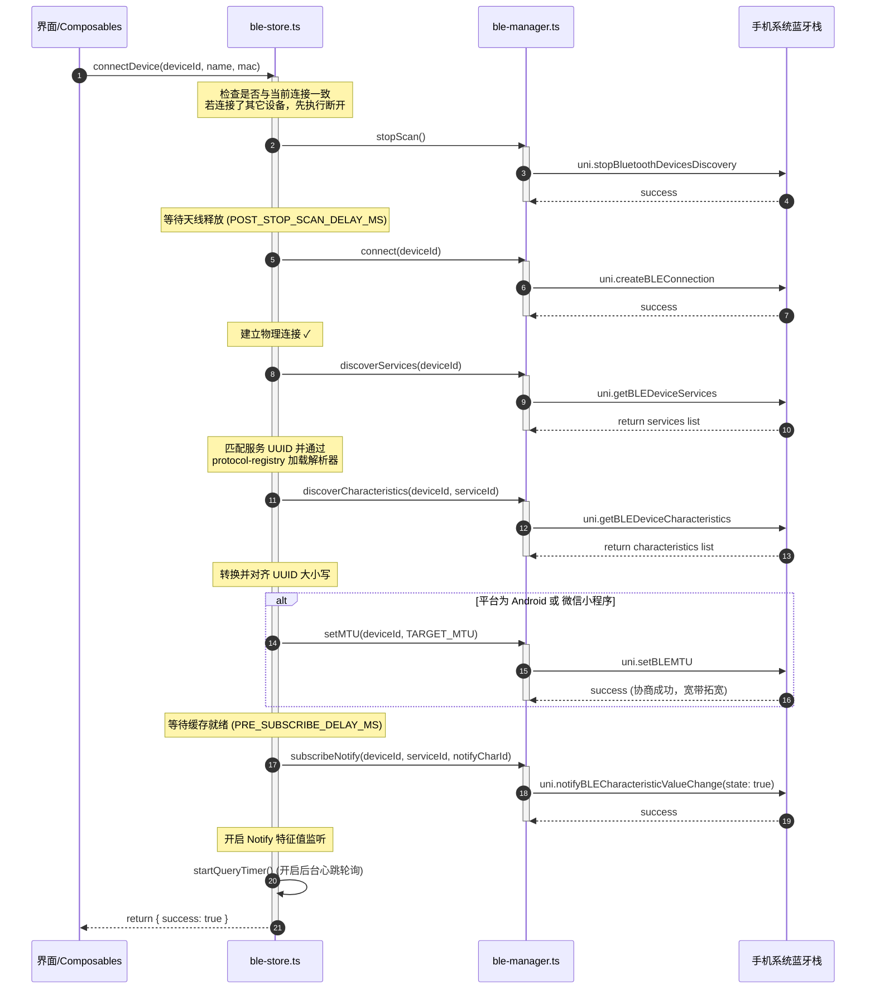

# 2. 蓝牙物理连接生命周期

蓝牙连接包含一套严密的、经过物理环境及多品牌手机实测的兼容性时序，能最大程度防范 `10003`、`10004` 及 `10008` 等经典底层错误。

---

## 一、 详细连接时序

完整的连接时序涉及 9 个明确执行步骤：

---

## 二、 关键技术要点说明

### 1. 停止扫描释放天线 (步骤 1-2)
*   **原因**: 手机蓝牙天线是独占的。如果在扫描附近设备的同时发起物理连接（`uni.createBLEConnection`），会导致射频拥塞，在 Android 端抛出 `10003` (Connection Failed)。
*   **实现**: 连接开始时，必须调用 `bleManager.stopScan()` 停止扫描，并根据配置 `POST_STOP_SCAN_DELAY_MS` (默认 400ms) 的等待延时，等待天线资源彻底物理归位，再执行物理连接。

### 2. 强制物理连接时序 (步骤 4-7)
*   **原因**: iOS 及鸿蒙系统具有极严密的 GATT 特征值鉴权缓存保护。
*   **实现**: 物理连接建立成功后，必须先显式调用 `uni.getBLEDeviceServices`（服务发现），随后遍历调用 `uni.getBLEDeviceCharacteristics`（特征值发现）。如果跳过此发现流程直接读写特征值，系统会找不到句柄，抛出 `10004` (No service) 或 `10008` (No characteristic)。

### 3. 服务与特征值 UUID 格式大小写对齐
*   **原因**: 各端系统蓝牙栈在返回发现的 UUID 时格式不一（例如 iOS 返回全大写 UUID，微信小程序返回小写，部分低端机返回简写格式）。
*   **实现**: `bleStore.connectDevice` 会在获取系统返回的物理 UUID 后，执行大小写转换匹配，若匹配成功，**强制使用系统物理返回的原始 UUID 字符串覆盖缓存的 UUID**，以防止由于大小写不匹配在读写时遭遇 `10008`。

### 4. 动态 MTU 协商 (步骤 8)
*   **机制**: 低功耗蓝牙的初始默认 MTU 大小仅为 `20 字节`。
*   **实现**: 
    *   **iOS 端**: 由操作系统在物理连接时，自动与蓝牙设备端交互完成 MTU 的极限拓宽（通常可达 185 字节），开发无需干预。
    *   **Android / 微信小程序**: 必须在发现特征值后，手动发起 `uni.setBLEMTU` 将包长度调整为 `TARGET_MTU` (默认 247 字节)，协商成功后实际最大发送载荷将更新为 `mtu - 3`。

### 5. GATT 缓存就绪延时 (步骤 9)
*   **机制**: 部分 Android BLE 芯片在特征值发现完毕后，内部 GATT 数据链路仍需微量空闲期去建立映射。
*   **实现**: 特征值发现完毕并对齐后，根据配置 `PRE_SUBSCRIBE_DELAY_MS` (默认 300ms) 强制休眠，之后再发起 `notifyBLECharacteristicValueChange` (特征值通知订阅)，彻底杜绝 Android 端出现 `10008 no descriptor` (找不到描述符) 阻断连接的现象。
