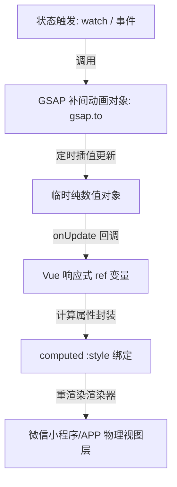

# 9. UI 视觉设计美学与 GSAP 动画体系

为了提供令人惊叹的 Wow 体验，项目在 UI 层面引入了高端的视觉设计美学（如莫兰迪色系渐变、极佳卡片圆角、明暗明度自适应）以及使用 GSAP 驱动的高级动画体系。

---

## 一、 视觉设计美学规范

本项目在色彩搭配与卡片微雕上遵循以下核心原则，确保首屏体验的高级与质感：
1. **色彩搭配**: 
   - 避免使用任何高饱和的纯红（`#ff0000`）、纯绿（`#00ff00`）等粗糙色调。
   - 采用经过语义化和谐配色的 HSL/HEX 渐变方案，配合 `12px` - `16px` 深色卡片圆角。
   - 提供莫兰迪系色彩芯片，支持在个人设置中一键热重绘系统主题色、警告色、成功色和危险色。
2. **布局框架**:
   - 布局层统一由全局高阶容器 `<layout-provider>` 包裹，支持 `pageFadeIn` 页面极简淡入。
   - 通用布局组件和排版工具类采用 UnoCSS，并强制带有 `wot-` 前缀（如 `wot-flex`, `wot-w-24`）。

---

## 二、 GSAP 动画机制与架构设计

针对多端（如微信小程序无真实 DOM 环境）的兼容性，项目严禁在动画中使用原生 DOM API（如 `document.querySelector`），所有复杂补间动画统一通过 **Vue 3 响应式状态（Ref）驱动风格绑定** 实现。

---

## 三、 核心动画 Hook 功能说明

目前项目中封装了三个高性能动画 Hook，统一存放于 `composables/` 目录：

### 1. 通用脉冲呼吸 Hook ([use-pulse-animation.ts](../composables/use-pulse-animation.ts))
*   **功能场景**: 蓝牙图标或状态指示器的呼吸渐变反馈。
*   **实现原理**: 驱动一个 `pulseOpacity` (从 `1` 到 `0.5` 的往复变化)。使用 `yoyo: true` 和 `repeat: -1` 实现无限呼吸循环，缓动选用 `power1.inOut` 模拟 CSS 呼吸质感。

### 2. 蓝牙搜索动画 Hook ([use-ble-search-animation.ts](../composables/use-ble-search-animation.ts))
*   **功能场景**: 扫描过程中的雷达波纹同心圆扩散（进度条已优化为纯 CSS 动画以保障性能）。
*   **实现原理**: 
  - 雷达波纹：对多个重叠圆盘的 `scale` 和 `opacity` 进行错开补间，达到逐级向外扩散淡出的视觉波纹效果。
  - 流光进度条（CSS 优化）：由于蓝牙扫描期间 JS 线程会被高频的设备发现回调与 `z-paging` 列表重绘大量占用，为了避免 JS 与 UI 线程通信堵塞造成卡顿，进度条动画已完全下沉为由 GPU 驱动的 CSS `@keyframes google-progress-flow` 动画。其通过 `translateX` 与 `scaleX` 在 Compositor 线程满帧渲染，实现了物理级丝滑。

### 3. 固件更新动画 Hook ([use-firmware-animation.ts](../composables/use-firmware-animation.ts))
*   **功能场景**: 升级过程中的文件上传浮动动画、更新中脉冲外环和指示灯闪烁。
*   **实现原理**:
  - 文件升级浮动：通过 `translateY` 周期性微调，模拟文件浮在设备上空的 3D 拟物感。
  - 指示灯闪烁：以固定的毫秒周期对指示灯圆点的 `opacity` 进行快速闪烁。

---

## 四、 GPU 性能优化与内存防泄露红线

GSAP 动画性能极高，但在移动端和小程序中必须采取策略防范 Reflow 抖动和内存溢出：

1. **GPU 硬件加速与重排防御**:
   - 严禁对重排属性（如 `top`、`left`、`width`、`height`）进行高频补间。
   - 动画补间属性强制使用 GPU 硬件加速的 `x`、`y`（或 `translateX`、`translateY`）、`scale`、`opacity`。
   - 在对应 CSS 样式中，显式声明 `will-change: transform, opacity` 以提前告知手机 GPU 开启分层渲染缓存。
2. **强制销毁清理防内存溢出 (红线)**:
   - 微信小程序与 App 的组件销毁和页面卸载如果遗留活跃的 GSAP 动画，会导致空轮询线程挂载，引起严重发热和内存溢出。
   - 所有动画 Hook 必须提供并导出 `stop` 方法（如 `stopPulse`），且在所在页面的 `onUnload` 生命周期或组件的 `onUnmounted` 生命周期中，**必须显式且主动调用销毁**（执行 `tween.kill()` 或 `gsap.killTweensOf(target)`）。
